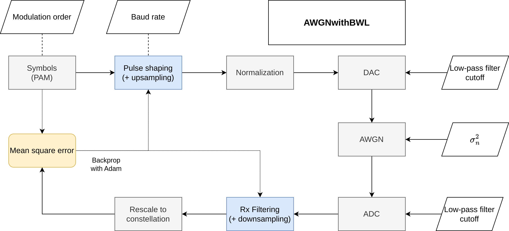
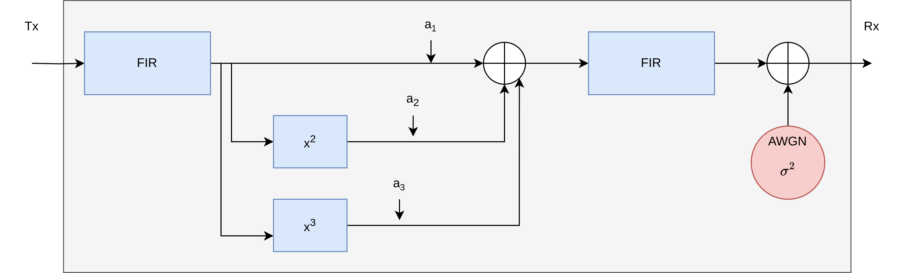

# End-to-end learning of optic fiber communication systems
This repository contains a collection of Python implementations for learning optimal transmitter and receiver parameters in an optical communication system. The term end-to-end refers to the fact that parameters from both sides of the channel are jointly optimized.

Currently, the repo uses automatic differentiation via. `pytorch` for ease of experimentation and prototyping.

## Getting started
The list of required packages is collected in the `requirements.txt` file. The Python version used to create the environment is 3.10.12.
Given that a Python virtual environment has been created (or an equivalent conda environment) the environment can be installed by the following command

```
pip install -r requirements.txt
```

Afterwards, install `torch` and `torchaudio` to fit your system specifications (CPU, GPU, Cuda version).
Please refer to the [pytorch](https://pytorch.org/get-started/locally/) installation page for details on this.

Finally, to get cubic spline support in torch, we use [Patrick Kidgers implementation](https://github.com/patrick-kidger/torchcubicspline), which can be installed as follows
``
pip install git+https://github.com/patrick-kidger/torchcubicspline.git@master
``

Once installed you should be able to run the main optimization script

```
python main_e2e.py
```

### Standalone example

A self-contained script that optimizes the Tx filter in an AWGN channel (*without* bandwidth limitation) has been implemented in `main_standalone_awgn.py`.
This is to showcase how the optimization loop is implemented in an end-to-end system. 
The equivalent system, implemented with a class-based structure can be seen in `lib/systems.py:BasicAWGN`.


## Additive white gaussian noise channel with bandwidth limitation

In the `system` library (`lib/systems.py`) an AWGN channel with bandwidth limitation has been implemented in `pytorch`. The bandwidth limitation arises from the digital-to-analog (DAC) and analog-to-digital (ADC) converters, both of which are modeled using a 2nd order Bessel filter, with a 3dB cutoff frequency relative to the specified baud rate. The symbols are propagated through the system and the mean squared error between the transmitted symbols and the symbols after the Rx filter is measured. This error is used in a stochastic gradient descent scheme to optimize the filters in the system.

The blockdiagram for this system can be seen below



This system is implemented in the three classes `PulseShapingAWGNwithBWL` (where the Rx filter is fixed), `RxFilteringAWGNwithBWL` (where the Tx filter is fixed) and `JointTxRxAWGNwithBWL` (where Rx and Tx filter are jointly optimized).

Please refer to the script `main_e2e.py` for an example of how the system is optimized.

## General non-linear channel with bandwidth limitation and noise

In addition to the AWGN channel, a more general channel with a non-linear response has been implemented in the `systems.py` library. The processing blocks are similarly implemented in `pytorch` and follow the same flow as the AWGN system abovem with the exception of the channel. A blockdiagram of the general non-linear channel can be seen below.



This system is implemented in the three classes `PulseShapingNonLinearISIChannel` (where the Rx filter is fixed), `RxFilteringNonLinearISIChannel` (where the Tx filter is fixed) and `JointTxRxNonLinearISIChannel` (where Rx and Tx filter are jointly optimized).

Please refer to the script `main_e2e_nonlin.py` for an example of how the system is optimized.

## Intensity modulation/direct detection channel
Inspired from [3], we implement an IM/DD system with an electro absorption modulator and a single mode fiber channel model.
The system is implemented in `PulseShapingIM` (where the Rx filter is fixed), `RxFilteringIM` (where the Tx filter is fixed) and `JointTxRxIM` (where Rx and Tx filter are jointly optimized).

Please refer to the script `main_e2e_imdd.py` for an example of how the system is optimized.

## Acknowledgements
The work carried out in this repository is part of a research project [MAchine leaRning enaBLEd fiber optic communication](https://veluxfoundations.dk/en/villum-synergy-2021) (MARBLE) funded by the Villum foundation.

## References

[1] B. Karanov et al., “End-to-End Deep Learning of Optical Fiber Communications,” Journal of Lightwave Technology, vol. 36, no. 20, pp. 4843–4855, Oct. 2018.

[2] O. Jovanovic, M. P. Yankov, F. Da Ros, and D. Zibar, “End-to-End Learning of a Constellation Shape Robust to Channel Condition Uncertainties,” Journal of Lightwave Technology, vol. 40, no. 10, pp. 3316–3324, May 2022, doi: 10.1109/JLT.2022.3169993.

[3] E. M. Liang and J. M. Kahn, “Geometric Shaping for Distortion-Limited Intensity Modulation/Direct Detection Data Center Links,” IEEE Photonics Journal, vol. 15, no. 6, pp. 1–17, 2023, doi: 10.1109/JPHOT.2023.3335398.
